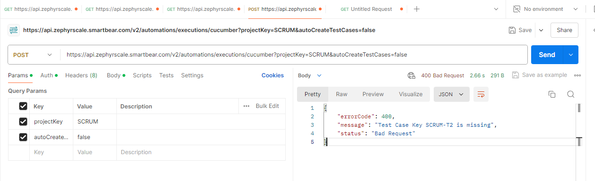
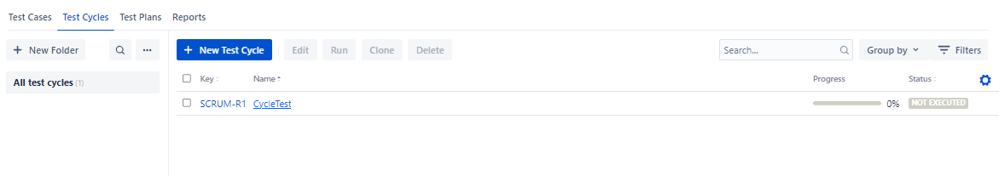
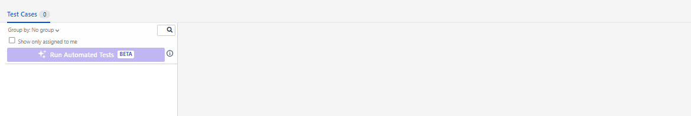
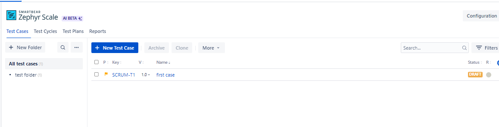
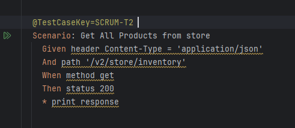
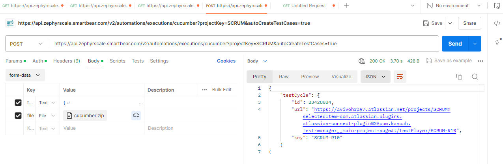

# Karate-Basic

zephyr

when test case key is in feature file but auto create is set to false, interation where cucumber 
is used in url

after

do not have test case key if not mapped
scrunm2 was set to true hence new case got created

https://api.zephyrscale.smartbear.com/v2/automations/executions/cucumber?projectKey=SCRUM&autoCreateTestCases=false

above will not create any new case and only update the existing

https://api.zephyrscale.smartbear.com/v2/automations/executions/cucumber?projectKey=SCRUM&autoCreateTestCases=true

creates a new case however, it will have a different test case id unlike the jira test case id.